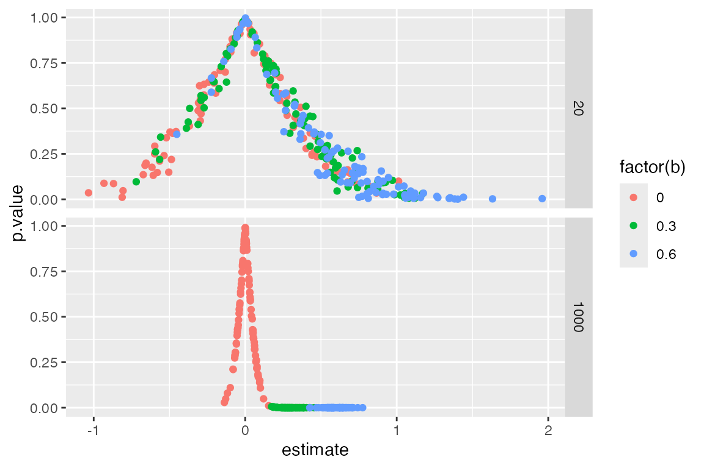

# DesignLibrary: a library of declared designs

## The idea

To contribute a design to **DesignLibrary** you just have to place a
self-contained `.R` file in `inst/designs/`. That file declares a design
and, optionally, a short YAML header. Once it is there, the design can
be loaded, modified, diagnosed, and browsed in the bundled Shiny app.

For the contribution workflow (fork, add file, refresh, check, pull
request), see the vignette *Contributing a design* or the Shiny
**Contribute** tab.

## What a design file looks like

Here is the starter design `two_arm_simple`.

`inst/designs/two_arm_simple.R`

``` r
---
id: two_arm_simple
label: Simple two-arm trial
category: template
keywords: [experiment, two-arm]
description: >
  Simple two-arm trial with complete random assignment and a population average treatment effect.
params:
  "N": "Number of units (sample or population size)"
  "b": "Treatment effect (outcome scale)"
diagnosands: [bias, power]
include_in_shiny: true
---

design <-
  
  declare_parameters(
    N = 1000,  # Number of units
    b = 0.2    # ATE
  ) +
  
  # M: model
  declare_model(N = N, Y_Z_0 = rnorm(n()), Y_Z_1  = Y_Z_0 + b) +
  
  # I: Inquiry
  declare_inquiry(ATE = mean(Y_Z_1 - Y_Z_0)) +

  # D: Data strategy  
  declare_assignment(Z = complete_ra(n())) +

  declare_measurement(Y = Z*Y_Z_1 + (1-Z)*Y_Z_0) +
  
  # A: Answer strategy
  declare_estimator(Y ~ Z, .method = difference_in_means, inquiry = "ATE")
```

The header is optional. At minimum you need a design object (by default
named `design`). Parameter tips are plain strings under `params:`; quote
keys such as `"N"` and `"b"`.

As soon as that file sits in `inst/designs/`, it is available to
[`make_design()`](https://declaredesign.org/r/designlibrary/reference/make_design.md),
[`get_args()`](https://declaredesign.org/r/designlibrary/reference/get_args.md),
[`get_code()`](https://declaredesign.org/r/designlibrary/reference/get_code.md),
the maintainer audits, and
[`run_shiny()`](https://declaredesign.org/r/designlibrary/reference/run_shiny.md).

## What designs are included?

``` r

list_designs()
#> DesignLibrary library: 68 designs
#> 
#> * Getting started
#>   two_arm_simple (Simple two-arm trial)
#>   two_arm_flexible (Flexible two-arm trial)
#>   three_arm (Three-arm trial)
#>   two_by_two (2x2 factorial (library))
#>   two_arm_block_cluster (Two arm trial with blocks and clusters)
#>   two_arm_with_blocks (Two-arm trial with blocks)
#>   two_arm_attrition (Two-arm trial with attrition)
#>   factorial_2x2x2 (2x2x2 factorial)
#>   multiarm_trial (Multi-arm trial)
#>   pretest_posttest (Pretest-posttest design)
#>   randomized_response (Randomized response)
#>   mediation_analysis (Mediation analysis)
#> 
#> * Other RDSS designs
#>   audit_experiment (audit experiment)
#>   audit_intervention (audit intervention)
#>   baseline_over_N (A baseline declaration intended to be reed over $N$.)
#>   blocked_and_clustered (blocked and clustered)
#>   bootstrapped (bootstrapped)
#>   cluster_random_sampling (cluster random sampling)
#>   conditional_expectation (Conditional expectation function)
#>   conjoint (conjoint)
#>   covariate_adjustment (covariate adjustment)
#>   declaration_using_declare (Example of declaration using Declare)
#>   ... and 46 more
#> 
#> print(list_designs(), list_all = TRUE) lists every design.
#> 
#> See design_info("id") or get_args("id") for details;
#> as.data.frame(list_designs(discover_params = TRUE)) for parameters.
```

Call
[`list_designs()`](https://declaredesign.org/r/designlibrary/reference/list_designs.md)
to see ids and labels. Use `design_info("two_arm_simple")` or
`get_args("two_arm_simple")` for one design, or
`as.data.frame(list_designs(discover_params = TRUE))` for the table
including redesignable parameters.

## Use DesignLibrary to make a design

``` r

my_design <- make_design("two_arm_simple")
my_design
#> Research design with 6 steps
#> 
#> Step 1 (parameters): declare_parameters(N = 1000, b = 0.2)
#> Step 2 (model): declare_model(N = N, Y_Z_0 = rnorm(n()), Y_Z_1 = Y_Z_0 + b)
#> Step 3 (inquiry): declare_inquiry(ATE = mean(Y_Z_1 - Y_Z_0))
#> Step 4 (assignment): declare_assignment(Z = complete_ra(n()))
#> Step 5 (measurement): declare_measurement(Y = Z * Y_Z_1 + (1 - Z) * Y_Z_0)
#> Step 6 (estimator): declare_estimator(Y ~ Z, .method = difference_in_means, inquiry = "ATE")
#> 
#> Parameters and objects the design refers to:
#>  name value   kind declared steps
#>     b   0.2 scalar     TRUE  1, 2
#>     N  1000 scalar     TRUE  1, 2
```

## Change parameters and simulate

Parameters are taken from the design itself. Pass new values to
[`make_design()`](https://declaredesign.org/r/designlibrary/reference/make_design.md);
under the hood this uses DeclareDesign’s `redesign()`. A core set of
designs also keep DesignLibrary 0.1 names, so
`two_arm_designer(N = 40, ate = 0.2)` is the same idea as
`make_design("two_arm_flexible", N = 40, ate = 0.2)`.

``` r

make_design("two_arm_simple", b = 0.3) |>
  simulate_design(sims = 2)
#> # A tibble: 2 × 15
#>   design   sim_ID term  estimate std.error statistic  p.value conf.low conf.high
#>   <chr>     <int> <chr>    <dbl>     <dbl>     <dbl>    <dbl>    <dbl>     <dbl>
#> 1 design_1      1 Z        0.405    0.0623      6.50 1.26e-10   0.283      0.527
#> 2 design_1      2 Z        0.202    0.0666      3.03 2.53e- 3   0.0710     0.332
#> # ℹ 6 more variables: df <dbl>, outcome <chr>, estimator <chr>, inquiry <chr>,
#> #   estimand <dbl>, b <dbl>
```

You can now change all parameters in one go.

``` r

make_design("two_arm_simple", b = c(0, .3, .6), N = c(20, 1000)) |>
  simulate_design(sims = 100) |>
  ggplot(aes(estimate, p.value, color = factor(b))) + 
  geom_point()  + facet_grid(N~.)
```



## Browse in Shiny

``` r

run_shiny()
```

The app opens on a searchable library table. Click a row to open the
design, expand its profile, run it once, diagnose it, or redesign
parameters. For a server deploy: install the package, run
[`install_library_dependencies()`](https://declaredesign.org/r/designlibrary/reference/install_library_dependencies.md),
then `copy_library_shiny(dest)`.

## Maintainer tools

A short set of helpers keeps the library honest:

- [`contributor_checklist()`](https://declaredesign.org/r/designlibrary/reference/contributor_checklist.md)
  — what a design file should satisfy
- [`audit_designs()`](https://declaredesign.org/r/designlibrary/reference/audit_designs.md)
  — load each design and check that YAML `params:` names match
  redesignable objects
- [`bake_previews()`](https://declaredesign.org/r/designlibrary/reference/bake_previews.md)
  — write compact diagnosis previews (`sims = 100` by default) into
  `inst/previews/`
- [`refresh_library()`](https://declaredesign.org/r/designlibrary/reference/refresh_library.md)
  — index, audit, and bake in one step

Run maintainer helpers from the package source tree, or set:

``` r

options(DesignLibrary.root = "C:/path/to/DesignLibrary")
refresh_library()
```

That is the whole loop: drop in a design file, use it from R or Shiny,
and refresh the library when you change the set. Step-by-step
contribution guidance is in
[`vignette("contributing", package = "DesignLibrary")`](https://declaredesign.org/r/designlibrary/articles/contributing.md).
